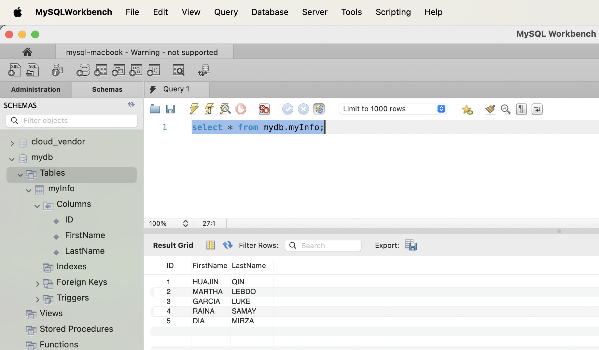
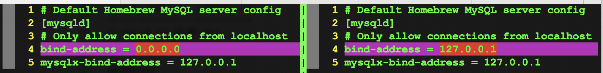
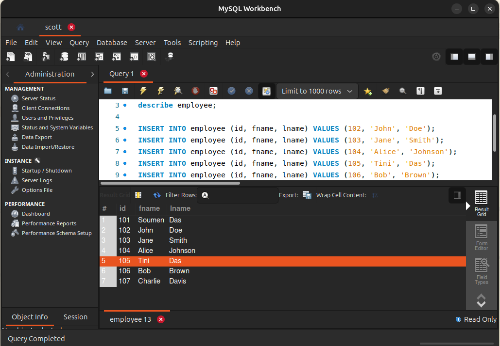

### System - my macbook air

```sql
mysql -u root
create database mydb;
GRANT ALL ON mydb.* TO 'soumen'@'%';
exit
```
```sql
$mysql -u soumen -p
Enter password: 
Welcome to the MySQL monitor.  Commands end with ; or \g.
Your MySQL connection id is 57
Server version: 9.1.0 Homebrew

Copyright (c) 2000, 2024, Oracle and/or its affiliates.

Oracle is a registered trademark of Oracle Corporation and/or its
affiliates. Other names may be trademarks of their respective
owners.

Type 'help;' or '\h' for help. Type '\c' to clear the current input statement.

mysql> USE mydb;
Database changed
mysql> CREATE TABLE myInfo (ID int, FirstName varchar(255), LastName varchar(255));
Query OK, 0 rows affected (0.03 sec)

mysql> INSERT INTO myInfo (ID, FirstName, LastName) VALUES (1, 'HUAJIN', 'QIN');
Query OK, 1 row affected (0.01 sec)

mysql> INSERT INTO myInfo (ID, FirstName, LastName) VALUES (2, 'MARTHA', 'LEBDO');
Query OK, 1 row affected (0.00 sec)

mysql> INSERT INTO myInfo (ID, FirstName, LastName) VALUES (3, 'GARCIA', 'LUKE');
Query OK, 1 row affected (0.00 sec)

mysql> INSERT INTO myInfo (ID, FirstName, LastName) VALUES (4, 'RAINA', 'SAMAY');
Query OK, 1 row affected (0.00 sec)

mysql> INSERT INTO myInfo (ID, FirstName, LastName) VALUES (5, 'DIA', 'MIRZA');
Query OK, 1 row affected (0.00 sec)

mysql> select * from myInfo;
+------+-----------+----------+
| ID   | FirstName | LastName |
+------+-----------+----------+
|    1 | HUAJIN    | QIN      |
|    2 | MARTHA    | LEBDO    |
|    3 | GARCIA    | LUKE     |
|    4 | RAINA     | SAMAY    |
|    5 | DIA       | MIRZA    |
+------+-----------+----------+
5 rows in set (0.00 sec)
```

Workbench:



#### Setup - Allow Remote Access
```
[soumendas@soumens-MacBook-Air 13:25:13 / ]
$find */* -name "*.cnf" -ls 2>/dev/null|grep "Jan 16"
11383620        8 -rw-r--r--    1 soumendas        admin                 145 Jan 16 02:50 System/Volumes/Data/opt/homebrew/etc/my.cnf
11383799        8 -rw-r-----    1 soumendas        admin                  56 Jan 16 02:51 System/Volumes/Data/opt/homebrew/var/mysql/auto.cnf
11383620        8 -rw-r--r--    1 soumendas        admin                 145 Jan 16 02:50 Volumes/Macintosh HD/System/Volumes/Data/opt/homebrew/etc/my.cnf
11383799        8 -rw-r-----    1 soumendas        admin                  56 Jan 16 02:51 Volumes/Macintosh HD/System/Volumes/Data/opt/homebrew/var/mysql/auto.cnf
11383620        8 -rw-r--r--    1 soumendas        admin                 145 Jan 16 02:50 Volumes/Macintosh HD/opt/homebrew/etc/my.cnf
11383799        8 -rw-r-----    1 soumendas        admin                  56 Jan 16 02:51 Volumes/Macintosh HD/opt/homebrew/var/mysql/auto.cnf
11383620        8 -rw-r--r--    1 soumendas        admin                 145 Jan 16 02:50 opt/homebrew/etc/my.cnf
11383799        8 -rw-r-----    1 soumendas        admin                  56 Jan 16 02:51 opt/homebrew/var/mysql/auto.cnf
```
old:
```
$cat /opt/homebrew/etc/my.cnf
# Default Homebrew MySQL server config
[mysqld]
# Only allow connections from localhost
bind-address = 127.0.0.1
mysqlx-bind-address = 127.0.0.1
```
New: 
```
$cat /opt/homebrew/etc/my.cnf
# Default Homebrew MySQL server config
[mysqld]
# Only allow connections from localhost
bind-address = 0.0.0.0
mysqlx-bind-address = 127.0.0.1
```


Restart mysql 
```bash
mysql.server stop;mysql.server start
OR
mysql.server restart
```

#### Test From Ubuntu (Other system in the same network)
```bash
[soumendas@soumens-MacBook-Air 13:07:44 Lab ]
$ssh UB
Welcome to Ubuntu 24.04.1 LTS (GNU/Linux 6.8.0-51-generic x86_64)

 * Documentation:  https://help.ubuntu.com
 * Management:     https://landscape.canonical.com
 * Support:        https://ubuntu.com/pro

Expanded Security Maintenance for Applications is enabled.

10 updates can be applied immediately.
To see these additional updates run: apt list --upgradable

Last login: Sat Jan 18 11:36:29 2025 from 192.168.1.176


soumen@UB:~$ mysql -u soumen -p -h 192.168.1.176
Enter password: 
Welcome to the MySQL monitor.  Commands end with ; or \g.
Your MySQL connection id is 8
Server version: 9.1.0 Homebrew

Copyright (c) 2000, 2024, Oracle and/or its affiliates.

Oracle is a registered trademark of Oracle Corporation and/or its
affiliates. Other names may be trademarks of their respective
owners.

Type 'help;' or '\h' for help. Type '\c' to clear the current input statement.


mysql> use mydb;
Reading table information for completion of table and column names
You can turn off this feature to get a quicker startup with -A

Database changed


mysql> show tables;
+----------------+
| Tables_in_mydb |
+----------------+
| Employee       |
| GenZLingo      |
| myInfo         |
+----------------+
3 rows in set (0.01 sec)


mysql> select * from Employee;
+------+-----------+----------+
| ID   | FirstName | LastName |
+------+-----------+----------+
|    1 | HUAJIN    | QIN      |
|    2 | MARTHA    | LEBDO    |
|    3 | GARCIA    | LUKE     |
|    4 | RAINA     | SAMAY    |
|    5 | DIA       | MIRZA    |
+------+-----------+----------+
5 rows in set (0.01 sec)

```


### System - my Ubuntu Server
```bash
sudo mysql -u root
```
```sql
mysql> USE mysql;
Reading table information for completion of table and column names
You can turn off this feature to get a quicker startup with -A

Database changed
mysql> SELECT User, Host, plugin FROM mysql.user;
+------------------+-----------+-----------------------+
| User             | Host      | plugin                |
+------------------+-----------+-----------------------+
| SCOTT            | localhost | caching_sha2_password |
| debian-sys-maint | localhost | caching_sha2_password |
| mysql.infoschema | localhost | caching_sha2_password |
| mysql.session    | localhost | caching_sha2_password |
| mysql.sys        | localhost | caching_sha2_password |
| root             | localhost | auth_socket           |
+------------------+-----------+-----------------------+
6 rows in set (0.00 sec)


ALTER USER 'SCOTT'@'localhost' IDENTIFIED BY '@***123***@'
SELECT VALIDATE_PASSWORD_STRENGTH ('@***123***@');

mysql> show databases;
+--------------------+
| Database           |
+--------------------+
| emp                |
| information_schema |
| mysql              |
| performance_schema |
| sys                |
+--------------------+
mysql> use emp;
Reading table information for completion of table and column names
You can turn off this feature to get a quicker startup with -A

Database changed
mysql> use emp;
Reading table information for completion of table and column names
You can turn off this feature to get a quicker startup with -A

mysql> select * from employee;
+------+--------+-------+
| id   | fname  | lname |
+------+--------+-------+
|  101 | Soumen | Das   |
+------+--------+-------+
1 row in set (0.00 sec)
Database changed
select * from employee;

mysql> describe employee;
+-------+-------------+------+-----+---------+-------+
| Field | Type        | Null | Key | Default | Extra |
+-------+-------------+------+-----+---------+-------+
| id    | int         | YES  |     | NULL    |       |
| fname | varchar(32) | YES  |     | NULL    |       |
| lname | varchar(32) | YES  |     | NULL    |       |
+-------+-------------+------+-----+---------+-------+
3 rows in set (0.03 sec)


INSERT INTO employee (id, fname, lname) VALUES (102, 'John', 'Doe');
INSERT INTO employee (id, fname, lname) VALUES (103, 'Jane', 'Smith');
INSERT INTO employee (id, fname, lname) VALUES (104, 'Alice', 'Johnson');
INSERT INTO employee (id, fname, lname) VALUES (106, 'Bob', 'Brown');
INSERT INTO employee (id, fname, lname) VALUES (107, 'Charlie', 'Davis');
```
IDE:

<br>
