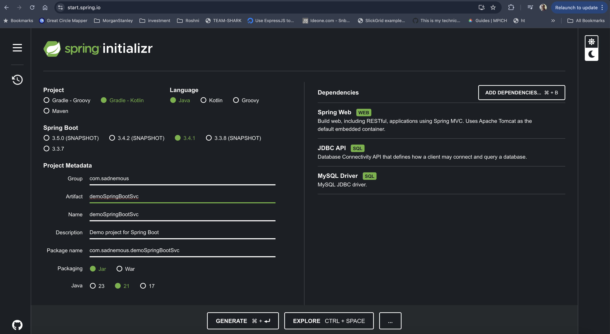
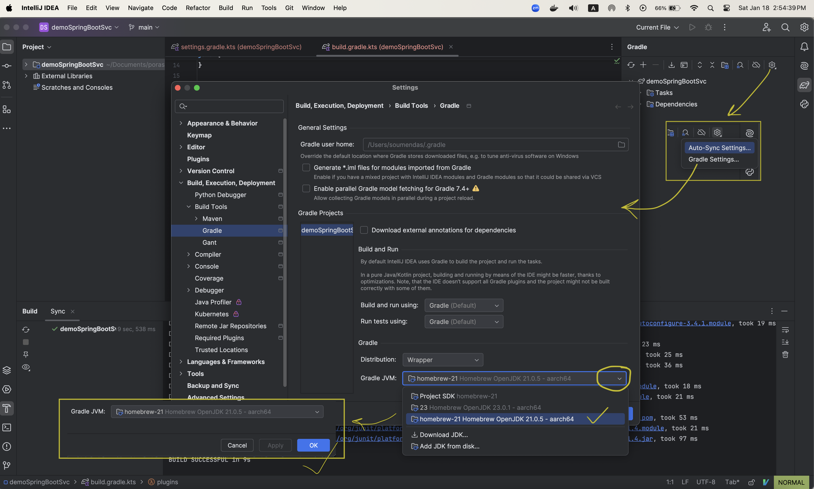

## Trying a new CRUD RestAPI, 

[!NOTE]
it's a journy.. be patient.. It's kind of monologue. After two years will see how noob I was :laughing:

### Step 1. https://start.spring.io/
Project: Gradle - Kotlin
Language: Java
Spring Boot: 3.4.1
Project Metadata:
    Group: com.sadnemous
    Artifact: demoSpringBoot
    Name: demoSpringBoot
    Package Name: com.sadnemous.demoSpringBootSvc
    Packaging: Jar
    Java: 21
<br>


### Step 2. Unzip and open with IntelliJ CE
#### 1. Gradle build failed<br>
##### <mark>Fix</mark>
Select proper JVM<br>

<br>

Restart gradle build
```log
Starting Gradle Daemon...
Gradle Daemon started in 809 ms
> Task :prepareKotlinBuildScriptModel UP-TO-DATE
Download https://repo.maven.apache.org/maven2/com/google/protobuf/protobuf-java/4.26.1/protobuf-java-4.26.1.pom, took 21 ms
Download https://repo.maven.apache.org/maven2/com/google/protobuf/protobuf-parent/4.26.1/protobuf-parent-4.26.1.pom, took 18 ms
Download https://repo.maven.apache.org/maven2/com/google/protobuf/protobuf-bom/4.26.1/protobuf-bom-4.26.1.pom, took 17 ms
Download https://repo.maven.apache.org/maven2/org/springframework/boot/spring-boot-starter-test/3.4.1/spring-boot-starter-test-3.4.1.module, took 36 ms
Download https://repo.maven.apache.org/maven2/org/springframework/boot/spring-boot-test/3.4.1/spring-boot-test-3.4.1.module, took 19 ms
Download https://repo.maven.apache.org/maven2/com/jayway/jsonpath/json-path/2.9.0/json-path-2.9.0.module, took 16 ms
Download https://repo.maven.apache.org/maven2/org/junit/jupiter/junit-jupiter/5.11.4/junit-jupiter-5.11.4.module, took 25 ms
Download https://repo.maven.apache.org/maven2/org/springframework/boot/spring-boot-test-autoconfigure/3.4.1/spring-boot-test-autoconfigure-3.4.1.module, took 19 ms
Download https://repo.maven.apache.org/maven2/org/springframework/spring-test/6.2.1/spring-test-6.2.1.module, took 19 ms
Download https://repo.maven.apache.org/maven2/org/junit/jupiter/junit-jupiter-api/5.11.4/junit-jupiter-api-5.11.4.module, took 23 ms
Download https://repo.maven.apache.org/maven2/org/junit/jupiter/junit-jupiter-engine/5.11.4/junit-jupiter-engine-5.11.4.module, took 25 ms
Download https://repo.maven.apache.org/maven2/org/junit/jupiter/junit-jupiter-params/5.11.4/junit-jupiter-params-5.11.4.module, took 36 ms
Download https://repo.maven.apache.org/maven2/org/opentest4j/opentest4j/1.3.0/opentest4j-1.3.0.module, took 18 ms
Download https://repo.maven.apache.org/maven2/org/junit/platform/junit-platform-commons/1.11.4/junit-platform-commons-1.11.4.module, took 18 ms
Download https://repo.maven.apache.org/maven2/org/junit/platform/junit-platform-engine/1.11.4/junit-platform-engine-1.11.4.module, took 21 ms
Download https://repo.maven.apache.org/maven2/org/apiguardian/apiguardian-api/1.1.2/apiguardian-api-1.1.2.module, took 19 ms
Download https://repo.maven.apache.org/maven2/org/junit/platform/junit-platform-launcher/1.11.4/junit-platform-launcher-1.11.4.pom, took 53 ms
Download https://repo.maven.apache.org/maven2/org/junit/platform/junit-platform-launcher/1.11.4/junit-platform-launcher-1.11.4.module, took 21 ms
Download https://repo.maven.apache.org/maven2/org/junit/platform/junit-platform-launcher/1.11.4/junit-platform-launcher-1.11.4.jar, took 97 ms

BUILD SUCCESSFUL in 9s
```

#### 2. Tried to build but failed
```log

2025-01-18T15:15:48.315-06:00  WARN 49596 --- [demoSpringBootSvc] [           main] ConfigServletWebServerApplicationContext : Exception encountered during context initialization - cancelling refresh attempt: org.springframework.beans.factory.BeanCreationException: Error creating bean with name 'dataSource' defined in class path resource [org/springframework/boot/autoconfigure/jdbc/DataSourceConfiguration$Hikari.class]: Failed to instantiate [com.zaxxer.hikari.HikariDataSource]: Factory method 'dataSource' threw exception with message: Failed to determine a suitable driver class
2025-01-18T15:15:48.316-06:00  INFO 49596 --- [demoSpringBootSvc] [           main] o.apache.catalina.core.StandardService   : Stopping service [Tomcat]
```
<br>

##### <mark>Fix</mark>

updated application.properties file as follows <br>

```
spring.application.name=demoSpringBootSvc
spring.datasource.url=jdbc:mysql://localhost:3306/mydb
spring.datasource.username=soumen
spring.datasource.password=das
spring.datasource.driverClassName=com.mysql.jdbc.Driver
server.port=9008
```
#### 3. So far so good. I have added following 
model/Employee.java
```java
package com.sadnemous.demoSpringBootSvc.model;

public record Employee (
        int ID,
        String FirstName,
        String LastName
){}

```

controller/DemoSpringBootSvcController.java
```java
package com.sadnemous.demoSpringBootSvc.controller;

import com.sadnemous.demoSpringBootSvc.model.Employee;
import org.springframework.http.ResponseEntity;
import org.springframework.web.bind.annotation.GetMapping;
import org.springframework.web.bind.annotation.RequestMapping;
import org.springframework.web.bind.annotation.RestController;

@RestController
@RequestMapping()

public class DemoSpringBootSvcController {
    @GetMapping("/getempsvc")
    public ResponseEntity <Employee> getEmp ()
    {
        Employee emp = new Employee(31291, "Soumen", "Das");
        return ResponseEntity.ok(emp);

    }
}
```

curl.sh
```bash
curl -H "Accept: application/json" \
     -H "Content-Type: application/json" \
     -X GET http://localhost:9008/getEmpSvc 2> /dev/null|python3 -mjson.tool 
```
output
```json
{
    "timestamp": "2025-01-18T23:53:14.181+00:00",
    "status": 404,
    "error": "Not Found",
    "path": "/getEmpSvc"
}
```

<mark>Wow, endpoint is case sensitive!! Modified the curl.sh</mark><br>
```bash
curl -H "Accept: application/json" \
     -H "Content-Type: application/json" \
     -X GET http://localhost:9008/getEmpSvc 2> /dev/null|python3 -mjson.tool 
```

output:
```json
{
    "ID": 11089,
    "FirstName": "Soumen",
    "LastName": "Das"
}
```

#### 4. Time to create service layer:
create dir service and create two java file:
```bash
mkdir service
touch service/IDemoSpringBootSvcService.java
touch service/DemoSpringBootSvcServiceImpl.java
```

Try 1:
```java
//service/IDemoSpringBootSvcService.java
package com.sadnemous.demoSpringBootSvc.service;

import com.sadnemous.demoSpringBootSvc.model.Employee;

public interface IDemoSpringBootSvcService {
    public Employee getEmp();
}
```
```java
//service/DemoSpringBootSvcServiceImpl.java
package com.sadnemous.demoSpringBootSvc.service;

import com.sadnemous.demoSpringBootSvc.model.Employee;

public class DemoSpringBootSvcServiceImpl implements IDemoSpringBootSvcService{
    @Override
    public Employee getEmp()
    {
        Employee emp = new Employee(21222, "Robin", "Hood");
        return emp;
    }
}
```
<mark>BEN STOKES!!! FAILED!! But Why?</mark><br>
```log
2025-01-18T18:17:50.633-06:00  WARN 56902 --- [demoSpringBootSvc] [           main] ConfigServletWebServerApplicationContext : Exception encountered during context initialization - cancelling refresh attempt: org.springframework.beans.factory.UnsatisfiedDependencyException: Error creating bean with name 'demoSpringBootSvcController': Unsatisfied dependency expressed through field 'svcService': No qualifying bean of type 'com.sadnemous.demoSpringBootSvc.service.IDemoSpringBootSvcService' available: expected at least 1 bean which qualifies as autowire candidate. Dependency annotations: {@org.springframework.beans.factory.annotation.Autowired(required=true)}
2025-01-18T18:17:50.633-06:00  INFO 56902 --- [demoSpringBootSvc] [           main] o.apache.catalina.core.StandardService   : Stopping service [Tomcat]
2025-01-18T18:17:50.639-06:00  INFO 56902 --- [demoSpringBootSvc] [           main] .s.b.a.l.ConditionEvaluationReportLogger : 
```
So the issue is `UnsatisfiedDependencyException` which means Spring Container does not have any idea about `IDemoSpringBootSvcService`<br>
To let Spring know about the class and make it as Bean we need `@Component` or `@Repository` or `@Service` etc.. annotation. <br>
Here I missed `@Service`..<br>
Let me add retry...<br>
<Mark> FIX</mark>
```java
//service/DemoSpringBootSvcServiceImpl.java
package com.sadnemous.demoSpringBootSvc.service;

import com.sadnemous.demoSpringBootSvc.model.Employee;
@Service
public class DemoSpringBootSvcServiceImpl implements IDemoSpringBootSvcService{
    @Override
    public Employee getEmp()
    {
        Employee emp = new Employee(21222, "Robin", "Hood");
        return emp;
    }
}
```
Try 2. Now run.. 
<b>BUILD SUCCESS!!! OOOOO Maa Go Turu Love!! </b><br>
Let me run the curl.sh<br>
OUTPUT<br>
```bash
$ ./curl.sh
{
    "ID": 21222,
    "FirstName": "Robin",
    "LastName": "Hood"
}

```
#### 5. So far so good, so Response is getting returned from Service Layer.. Now let me try to implement Repository:
create dir `repository` and create one java file, this time use IntelliJ IDE..


#### <font style="color: crimson; background-color: #f1f1f1;">Comparison knowledge DTO, Entity and Record</font>
|Sl|DTO|Record|Entity|
|---|---|---|---|
|1|Data Transfer Object|Same|business domain
|2|transferring data from Controller -> Service Layer -> Repository|same|Represents a persistent data structure mapped to a database table using an ORM like JPA
|3|Simple POJO Class|record keyword|@Entity annotation required|
|4|Mutable|Immutable|Mutable|
|5|<pre>public class UserDTO {<br>   private String userid;<br>   private int age;<br>   // Getters and setters<br> }<br></pre>|``` record User(String userid, int age) { }```|<pre> @Entity<br> @Table(name = "users")<br> public class User<br>{<br>   @Id<br>   @GeneratedValue<br>   private Long id;<br>   private String userid;<br>   private int age;<br>   private String address;<br>   private String alien_status;<br>   // Getters and setters<br> }<br></pre>|
|6|DTO to Domain mapper to be implemented, to be used in Repo|RowMapper to be implemented|Domain to DTO mapper needed

#### <font style="color: crimson; background-color: #f1f1f1;">What is Record?</font>

#### <font style="color: crimson; background-color: #f1f1f1;">What is RowMapper?</font>
A `RowMapper` in Spring JDBC is a functional interface used to map a single row of a result set (from a database query) to a corresponding object in your Java application. It’s typically used with the JDBCTemplate class for query operations, allowing you to transform each row of the result set into a domain object.

Key Points About `RowMapper`:
 1. It simplifies the mapping of database rows to Java objects, reducing boilerplate code.
 2. It's particularly useful when you need custom mapping logic or when working with complex result sets.
 3. It is used with methods like `query()` in `JdbcTemplate`.
<br><br>

 `RowMapper` Functional Interface:
 

 ```java
 @FunctionalInterface
public interface RowMapper<T> {
    T mapRow(ResultSet rs, int rowNum) throws SQLException;
}
```
  `mapRow(ResultSet rs, int rowNum):` This method maps a single row of data from the `ResultSet` to an object of type `T`.


Example: Using `RowMapper` in `JDBCTemplate`

record User(String userid, int age) { }


#### <font style="color: crimson; background-color: #f1f1f1;">What should I use service to repository dto or entity or record?</font>
When using a service layer, you should generally interact with the repository using `Data Transfer Objects (DTOs)`, <br>rather than directly using `entities` or `records`,<br> as `DTO`s provide a cleaner separation of concerns by acting as a dedicated <b>data transfer mechanism</b> between layers <br>and allowing for controlled data exposure to the presentation layer, <br>while entities should remain within the data access layer

#### <font style="color: crimson; background-color: #f1f1f1;">Where should I keep my DTO class?</font>
In a Spring Boot application, you should typically place your DTO (Data Transfer Object) classes in a separate package named "dto", which is usually considered a part of the "controller" layer, as DTOs are primarily used for data exchange between the client and the application's API endpoints managed by controllers.<br>
<br><b>Explanation:</b><br>
<br><b>Model:</b><br>
The "model" package is usually reserved for entities that directly represent data in your database, which are not exactly the same as DTOs as they may contain additional fields not needed for client communication.<br>
<br><b>View:</b><br>
The "view" package is for presentation logic, like handling how data is displayed to the user, and is not directly related to DTOs.<br>
<br><b>Controller:</b><br>
Since DTOs are used to transfer data between your application and the outside world (clients), the "controller" package is the most logical place to put them.<br>

<br><b>Repository:</b><br>
The "repository" package is for interacting with the database, and DTOs are not meant to be used in this layer.

<br><b>
Key points about DTOs:
</b><br>
 - <b>Data encapsulation</b>: DTOs encapsulate the data needed for a specific API request or response, often including only a subset of fields from the corresponding entity model.
 - <b>Decoupling</b>: By using DTOs, you can decouple the presentation layer (controller) from the data layer (repository and entities).
Validation: DTOs are often used to implement validation logic for incoming data.<br>
<br><b>
Example project structure:
</b><br>
```
src

  - main

    - java

      - com.example

        - controller

          - UserController.java

        - dto

          - UserDto.java

        - model

          - User.java

        - repository

          - UserRepository.java 
```


